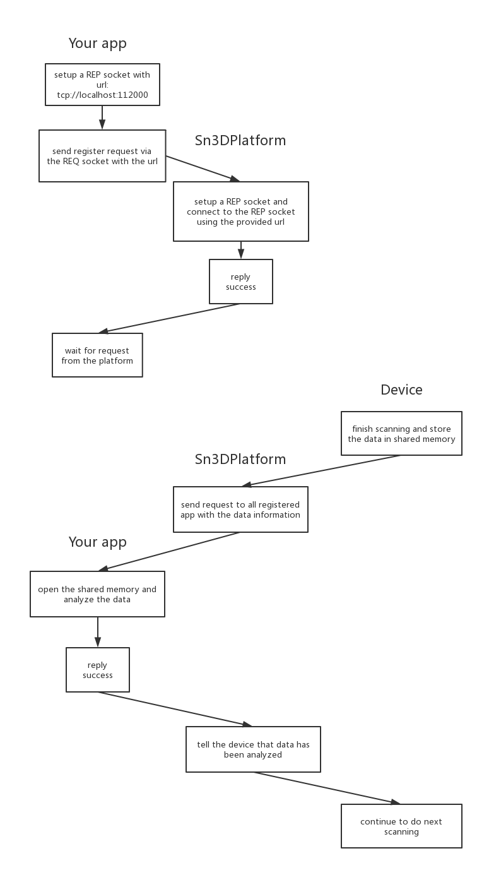

# SDK Q&A

## Q: How to launch to Sn3DPlatform?

A: Sn3DPlatform is an executable which can be launched directly by double-click the exe file. Developers can also use language-specific commands to start the exe indirectly.

## Q: How to communicate with Sn3DPlatform?

A: You should setup at least 2 ZMQ sockets to communicate with Sn3DPlatform:

1. SUB socket. It should connect to the port of Sn3DPlatform's PUB socket to receive any broadcast information published by the SDK platform.
2. REQ socket. It should connect to the port of Sn3DPlatform's REP socket to send any request to control the device.

**ATTENTION**: You **MUST** call `v1.0/device/check` via the REQ socket before any other requests, and check the results of the request to make sure the USB and GPU are both OK and the device is online.

If you want to resolve the scanned data like point clouds, wrapped meshes etc, you should setup a 3rd ZMQ socket to wait for request from the SDK platform. Unlike the first two sockets, the 3rd socket is a REP socket, which means you should get an available port and bind the port to the socket to wait for the connecting and requests from the SDK. You should send the URL of this socket to the SDK platform under the interface `v1.0/scan/register` via the REQ socket to the platform. And after that, when any big data is ready, the platform will send request to your REP socket with necessary information of the big data. Your app will be able to open the shared memory and analyze the data, then reply back tot he platform to finish the request-reply pattern.

Suppose that port 11200 is available on the computer, then the workflow is shown below:

## Q: Why does the creating or opening projects fail?

A: Please make sure that you have set one of the three scanning modes (fixed, HD, rapid) before creating or opening any projects. You can use the Request Set interface `v1.0/scan/type/set` and provide the coresponding scan type to make the device enter certain scanning type mode.

## Q: How to change different scanning types?

A: You should first exit scanning before changing other scanning types. Then you can use the Request Set interface `v1.0/scan/type/set` and provide the coresponding scan type to make the device enter certain scanning type mode.

## Q: How to control the scanning?

A: The controlling interface is `v1.0/scan/control`.

For fix mode, if the device has turnable, then you can start and then pause or resume the scanning; otherwise, you need only start the scanning, and after scanning one frame, the device will stop by itself.

For hd/rapid mode, you **MUST** first do pre scanning, then start scanning, then you can pause or resume scanning.  

## *Q: When I display the points, the currentPointCloud and the wholePointCloud look the same?*  

A: Actually, for the first frame the data of whole point and current point is indeed the same. However, for the subsequent frames, the whole points are updated in an incremental manner while the current point cloud is updated in the same manner as the first frame. So from the 2nd frame and so on, the whole point data should be different from the current point cloud.

For incremental `wholePointCloud`(the `incremental` property is `true` of its props), you should update point cloud data according to the value of ID. When you receive the `incremental` wholePointCloud data, you can iterate the point cloud data to get the value of IDs which are the indice of data array. If the ID is smaller then the size of the whole point cloud, it means it is an *old* point, and you should update the origin position, normal and color using received data through the new inex of id; If the ID is equal to or larger than the size of the whole point cloud, it means it is a *new* point, and you need to append this point to the whole point cloud (effectively expanding the whole point cloud).  

## *Q: For questions such as receiving point clouds, the position and normal data sequence is mixed up and the point cloud orientation is modified ?*  

A: This problem may come because you manuplate the same share memory for the whole point cloud and current point cloud. These two point clouds share the same memory type of `MT_POINT_CLOUD`, however, the names of memory are different, i.e. the name for current point is `currentPointCloud` and the whole point name is `wholePointCloud`. You should distinguish them by the memory names and handle them accordingly.  

## *Q: About the markers, still no data ?*  

A: The reason for no marker data, I guess that you may create the project with scan align type `MT_FEATURE`. I reproduced the problem and got the marker data changed after pressing the button named refresh when I set the project type as `MT_MARKER`.  

## *Q: For the last question, I create a ZMQ socket and it works for some computers, I get the point clouds and final mesh. The problem is with some computers, the socket is created and the scanner acts like it is scanning (it emits light as usual), but there is absolutely nothing to listen to in the socket ?*  

A: One possible reason for that is the ZMQ socket port is occupied on the computers where the receiving function does not work.  

## *Q: When I start to scan, in preview mode, and it stops scanning for apparently no reason ?*  

A: Comparing the good scanning log to the stopping one, I find that it not enter the scan process with not printing relevant log. To locate the problem, I review the code for scan service to konw where to stop. Finally, I get the result that you will not save scan gray image sucessfully if your disk do not has enough space for save. So to ensure the program operating normally, you should make the project directory having enough space.